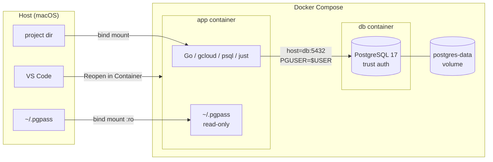

# devcontainer-demo

A Dev Container sample project with Go + PostgreSQL.

## Architecture



## Included

- Go (latest)
- Google Cloud CLI
- PostgreSQL 17 (multi-container, trust auth)
- psql client
- just (command runner)
- VS Code extensions: Go, Markdown Preview, Docker

## Prerequisites

- Docker Desktop
- VS Code + Dev Containers extension

## Setup

1. Open this folder in VS Code
2. Run "Reopen in Container"
3. On container startup, the following happens automatically:
   - A PostgreSQL role and database are created matching the host OS username
   - `~/.pgpass` is mounted read-only into the container
   - `PGUSER` is set to the host OS username

## Usage

```bash
# List available recipes
just

# Local environment (default: APPENV=local)
just run

# Production config
just run prod

# Check DB connectivity
just db-ping
```

## Environment Config

| | local | prod |
|------|-------|------|
| Host | `db` (compose service name) | `CHANGEME` |
| Port | 5432 | 5432 |
| Auth | trust (no user/password) | `.pgpass` via libpq |

Config files: `config/local.yaml`, `config/prod.yaml`

## Notes

- `host: db` in local config refers to the docker-compose service name. Inter-container communication uses service names, not `localhost`.
- If `~/.pgpass` does not exist on the host, an empty file is created automatically on first startup. Configure it properly before connecting to production.
- PostgreSQL data is persisted via Docker named volume (`postgres-data`).
